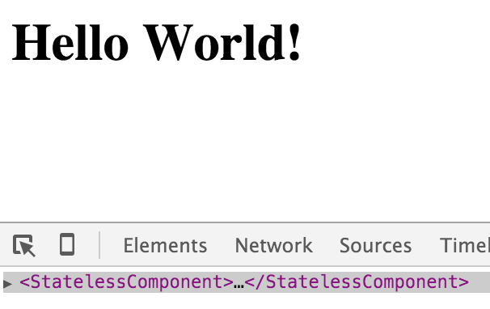

# babel-plugin-transform-react-stateless-component-name

[![Build Status][travis-image]][travis-url]
[![npm][npm-image]][npm-url]
[![Codecov.io][codecov-image]][codecov-url]

> Adds a display name to the stateless component in the React Dev Tools.
>
> **Note:** Now will add displayName property to functions as well to help with Snapshot testing.

## Example

```jsx
// App.jsx
import React from 'react'

export default () => (
  <h1>Hello World!</h1>
)

// index.js
import App from './App'
import React from 'react'
import { render } from 'react-dom'

render(<App />, document.getElementById('root'))
```

### Before



### After


## Installation

### Yarn

```
$ yarn add --dev babel-plugin-transform-react-stateless-component-name
```

### npm

```
$ npm install --save-dev babel-plugin-transform-react-stateless-component-name
```

## Usage

### Via `.babelrc` (Recommended)

**.babelrc**

```json
{
  "plugins": [
    "transform-react-stateless-component-name"
  ]
}
```

### Via CLI

```
$ babel --plugins transform-react-stateless-component-name script.js
```

### Via Node API

```js
require('babel-core').transform('code', {
  plugins: [
    'transform-react-stateless-component-name',
  ],
})
```

## Change Log

> [Full Change Log](changelog.md)

### [v1.1.2](https://github.com/wyze/babel-plugin-transform-react-stateless-component-name/releases/tag/v1.1.2) (2017-11-07)

* [[`673e2a4128`](https://github.com/wyze/babel-plugin-transform-react-stateless-component-name/commit/673e2a4128)] - Update to use `write-changelog` package (Neil Kistner)
* [[`a853f804b1`](https://github.com/wyze/babel-plugin-transform-react-stateless-component-name/commit/a853f804b1)] - Remove all istanbul ignores (#10) (Thomas Grainger)
* [[`e875edd575`](https://github.com/wyze/babel-plugin-transform-react-stateless-component-name/commit/e875edd575)] - Avoid crash on block-arrow components with hoc wrapper (#9) (Thomas Grainger)
* [[`e98586fe5a`](https://github.com/wyze/babel-plugin-transform-react-stateless-component-name/commit/e98586fe5a)] - Ignore JSX Expression blocks (#7) (Daniel J)

## License

Copyright © 2015-2016 [Neil Kistner](//github.com/wyze)

Released under the MIT license. See [license](license) for details.

[travis-image]: https://img.shields.io/travis/wyze/babel-plugin-transform-react-stateless-component-name.svg?style=flat-square
[travis-url]: https://travis-ci.org/wyze/babel-plugin-transform-react-stateless-component-name

[npm-image]: https://img.shields.io/npm/v/babel-plugin-transform-react-stateless-component-name.svg?style=flat-square
[npm-url]: https://npmjs.com/package/babel-plugin-transform-react-stateless-component-name

[codecov-image]: https://img.shields.io/codecov/c/github/wyze/babel-plugin-transform-react-stateless-component-name.svg?style=flat-square
[codecov-url]: https://codecov.io/github/wyze/babel-plugin-transform-react-stateless-component-name
