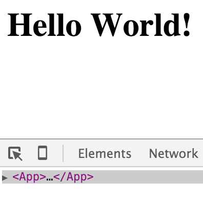

# babel-plugin-transform-react-stateless-component-name

[![Build Status][travis-image]][travis-url]
[![npm][npm-image]][npm-url]
[![Codecov.io][codecov-image]][codecov-url]

> Adds a display name to the stateless component in the React Dev Tools.

## Example

```javascript
// App.jsx
import React from 'react';

export default () => (
  <h1>Hello World!</h1>
);

// index.js
import App from './App'
import React from 'react';
import { render } from 'react-dom';

render(<App />, document.getElementById('root'));
```

### Before


### After



## Installation

```sh
$ npm install babel-plugin-transform-react-stateless-component-name
```

## Usage

### Via `.babelrc` (Recommended)

**.babelrc**

```json
{
  "plugins": ["transform-react-stateless-component-name"]
}
```

### Via CLI

```sh
$ babel --plugins transform-react-stateless-component-name script.js
```

### Via Node API

```javascript
require("babel-core").transform("code", {
  plugins: ["transform-react-stateless-component-name"]
});
```

## License

Copyright © 2015 [Neil Kistner](//github.com/wyze)

Released under the MIT license. See [license](license) for details.

[travis-image]: https://img.shields.io/travis/wyze/babel-plugin-transform-react-stateless-component-name.svg?style=flat-square
[travis-url]: https://travis-ci.org/wyze/babel-plugin-transform-react-stateless-component-name

[npm-image]: https://img.shields.io/npm/v/babel-plugin-transform-react-stateless-component-name.svg?style=flat-square
[npm-url]: https://npmjs.com/package/babel-plugin-transform-react-stateless-component-name

[codecov-image]: https://img.shields.io/codecov/c/github/wyze/babel-plugin-transform-react-stateless-component-name.svg?style=flat-square
[codecov-url]: https://codecov.io/github/wyze/babel-plugin-transform-react-stateless-component-name
